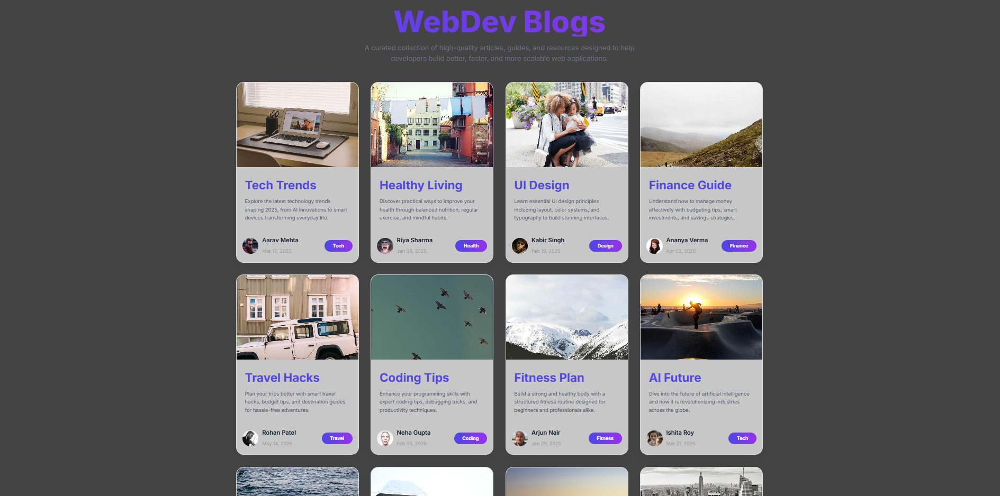
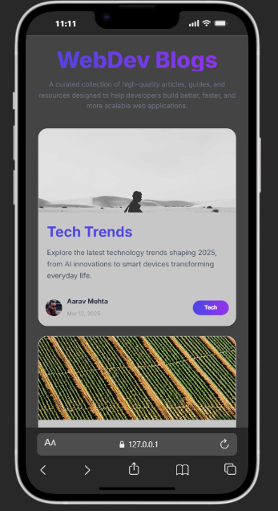

# 🌐 Blogs Website

🚀 **Live Demo:**
🔗 [Live Demo](https://blogs.webdevzone.in)

A modern, responsive blog website with a **clean UI and smooth user experience**, built using HTML, CSS, and JavaScript. Perfect for beginners learning frontend development and building real-world projects.

---

## ✨ Key Highlights

- ⚡ Fast and optimized performance
- 📱 Fully responsive (Mobile + Desktop)
- 🎯 Clean and minimal UI design
- 🧑‍💻 Beginner-friendly structure
- 🌐 Real-world blog layout experience

---

## 📌 About the Project

**Blogs Website** ek modern frontend project hai jo blog content ko clean aur structured format me display karta hai. Yeh project dynamic data handling (JSON) use karta hai.

Agar tum frontend development seekh rahe ho, to yeh project ek perfect real-world practice hai 💡

---

## 🛠️ Tech Stack

- 🌐 HTML5
- 🎨 CSS3
- ⚡ JavaScript
- 📦 JSON (for dynamic content)

---

## ✨ Features

- 📱 Fully Responsive Design (Mobile + Desktop)
- 🎯 Clean & Minimal UI
- ⚡ Fast Loading Speed
- 📰 Dynamic Blog Content (JSON based)
- 🔍 Easy Navigation
- 🎨 Modern Layout
- 💡 Beginner Friendly Code

---

## 📸 Screenshots

📸 
📸 

---

## ⚙️ Installation

Follow these steps to run the project locally:

```bash
# 1. Clone the repository
git clone https://github.com/webdev-desktop/blogs-website.git

# 2. Navigate into the project folder
cd blogs-website

# 3. Open index.html in your browser
```

---

## 🧑‍💻 Usage

1. Open the website in your browser
2. Browse through blog posts 📰
3. Explore UI and layout for learning purposes

---

## 🔮 Future Improvements

- 🔐 User authentication (Login/Signup)
- 📝 Admin panel to add/edit blogs
- 💬 Comment system
- 🔎 Search functionality
- 🌙 Dark mode toggle
- 📊 Blog categories & tags

---

## 🤝 Contribution

Contributions are always welcome!

If you'd like to improve this project:

1. Fork the repository
2. Create a new branch (`feature/your-feature-name`)
3. Commit your changes
4. Push to your branch
5. Open a Pull Request 🚀

---

## 👨‍💻 Author

**Apurv**
🔗 https://github.com/webdev-desktop

---

## 📄 License

This project is licensed under the **MIT License**.

---

⭐ If you like this project, don't forget to give it a star!
